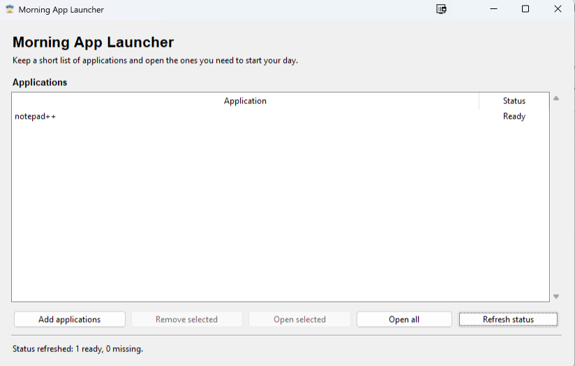

# Morning App Launcher

Morning App Launcher is a compact Windows desktop utility for keeping a short, reusable list of
applications and opening the right set at the start of the day. It replaces a repetitive manual
routine with a privacy-conscious Tkinter workflow that remains easy to inspect and test.



## Features

- Add and remove multiple applications at once.
- See friendly application names with `Ready` or `Missing` status.
- Open selected ready applications or every ready application.
- Continue a batch when one application is missing or fails to open.
- Store versioned configuration with atomic writes and safe legacy migration.
- Keep imports side-effect-free and operating-system launching behind an injectable boundary.
- Record rotating operational events without logging application paths or configuration contents.
- Use a responsive, keyboard-accessible Tkinter interface.

## Engineering highlights

- **Layered design:** domain models, controller/use cases, storage, presentation, GUI composition,
  and Windows process launching are separate modules.
- **Safe boundaries:** only the concrete Windows adapter calls `os.startfile`; tests use fakes and
  explicitly prevent the real launcher from running.
- **Reliable persistence:** versioned JSON, same-directory temporary files, `fsync`, atomic
  replacement, schema validation, and non-destructive migration protect local state.
- **Privacy by design:** friendly names are shown in the UI while operational logs contain only
  predefined event classifications and integer counts.
- **Release hygiene:** Windows CI spans every supported Python version, dependencies are bounded,
  packaging policy is tested, and executable builds are manual, unsigned artifacts.

## Architecture

```text
Tkinter MainWindow
      │
WindowPresenter ── presentation state and command routing
      │
ApplicationController ── add/remove/status/batch-launch use cases
      ├── JsonApplicationStore ── versioned JSON and atomic writes
      ├── WindowsApplicationLauncher ── the sole os.startfile boundary
      └── OperationalEventLogger ── rotating classifications and counts
```

The package uses a `src` layout under `src/morning_app_launcher`. `app.py` is the composition root;
importing it does not create a Tk root, enter `mainloop`, read user configuration, or launch a
process. The GUI starts only through the guarded `main()` entry point.

## Keyboard shortcuts

- `Enter`: open selected ready entries
- `Delete`: request removal of selected entries
- `Ctrl+O`: add applications
- `Ctrl+A`: select all entries
- `F5`: refresh status
- `Escape`: clear the current selection; native dialogs also support cancellation

## Installation from source

Morning App Launcher supports Python 3.10 through 3.13 on Windows. Tkinter is supplied by the
Python installation, and the application has no third-party runtime dependencies.

```powershell
py -3.13 -m venv .venv
.\.venv\Scripts\python.exe -m pip install -e ".[dev]"
```

Run the GUI only when you intend to use the desktop application:

```powershell
.\.venv\Scripts\morning-app-launcher.exe
```

Use **Add applications** to select local files. Missing entries stay visible so they can be
removed, but they are never passed to the Windows launcher.

## Configuration and legacy migration

The primary configuration file is:

```text
%LOCALAPPDATA%\MorningAppLauncher\config.json
```

If `LOCALAPPDATA` is unavailable, the application falls back to the equivalent per-user Windows
local application-data directory. The JSON document is versioned and stores the executable paths
selected by the local user. It must never be committed to source control.

On first start, when JSON configuration does not exist, the application looks for the legacy
ignored `save.txt` in the current working directory. Migration de-duplicates entries, writes JSON
atomically, and always leaves the legacy file unchanged. Failed migration, malformed JSON, and
unsupported schema versions are reported without silently overwriting user data.

## Privacy and security model

Saved executable paths remain local user configuration. Morning App Launcher does not transmit
them, print them, or include them in operational logs. Rotating logs live below the same per-user
application-data directory and contain only predefined event names and integer counts. Logging is
fail-open: setup, write, rotation, and close failures do not prevent normal operation.

The process-launch boundary is intentionally narrow but still powerful: `os.startfile` asks
Windows to open a user-selected local file with the current user's permissions. The application
does not sandbox processes, scan files for malware, verify publisher signatures, or replace normal
Windows security controls. See [SECURITY.md](SECURITY.md) for reporting and boundary details.

## Development and testing

Install the declared development tools, then run the same gates as CI:

```powershell
.\.venv\Scripts\python.exe -m pip install -e ".[dev]"
.\.venv\Scripts\python.exe -m pip check
.\.venv\Scripts\python.exe -m compileall -q src packaging
.\.venv\Scripts\python.exe -m ruff check src tests packaging
.\.venv\Scripts\python.exe -m mypy
.\.venv\Scripts\python.exe -m pytest
```

Tests isolate storage and GUI presentation logic, replace the Windows launcher with fakes, reject
real `os.startfile` calls, and verify that imports do not create a GUI. CI runs these checks on
Windows with Python 3.10, 3.11, 3.12, and 3.13.

## Windows executable artifact

The manual **Build Windows executable** GitHub Actions workflow builds one windowed
`MorningAppLauncher.exe`, creates a SHA-256 checksum beside it, and uploads only those two files as
a workflow artifact. It does not publish a GitHub Release.

The executable is **unsigned**. Windows SmartScreen may warn before opening it. The workflow does
not perform code signing, and the project does not claim bit-for-bit reproducible binaries.

For a local packaging experiment, install the separate bounded release tools with
`.[release]`. Never commit generated executables, checksums, specifications, build directories, or
PyInstaller caches.

## Project artwork

The Morning App Launcher icon is original project artwork created specifically for this project
with OpenAI image generation under the project owner's direction. Windows prefers the
multi-resolution ICO; Tk falls back to the transparent PNG if needed. Icon-loading failures are
cosmetic and never prevent startup.

## License

The source code is available under the [MIT License](LICENSE). No separate asset license is
declared for the original project icon.
